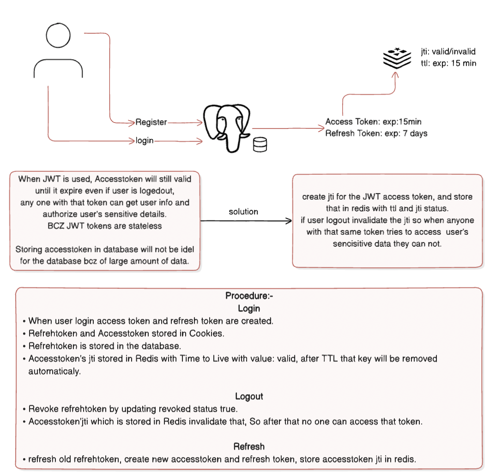
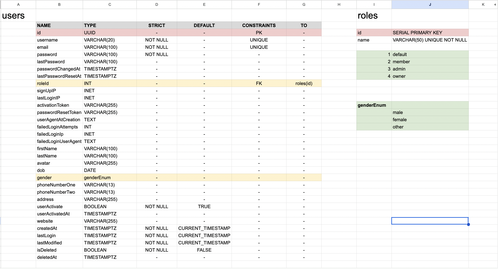
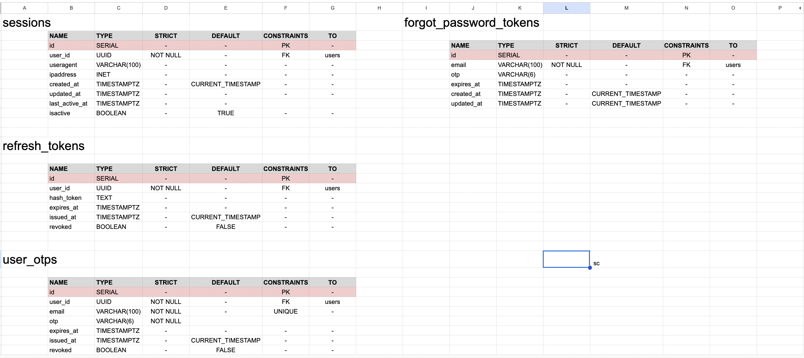

# goAuth

Secure User Authentication backend(only) microservice.

## Procedure



## Tech Stack

<p align="left">
    
    
    
    
</p>

## Key Capabilities

- Provides secure access and refresh tokens.
- Uses JWT for user authentication.
- Invalidates access tokens with Redis after logout.
- Manages user sessions across multiple devices.
- Activates users after registration via OTP verification.
- Notifies users of unauthorized account access, including browser and IP address details.
- Prevents users from reusing the last two passwords when changing credentials.

## What is goAuth?

- A fast HTTP authentication service for user management.
- A microservice designed to handle user authentication, account services, and tracking of user information.
- Provides a secure and high-performance solution, built with Go (Golang) and Gin, without relying on external ORMs.

## Run Locally

- #### Update .env file with postgresql database link
- #### Setup redis and update in .env
- #### Makesure have air, go migrate is setup currectly

Clone the project

```bash
    git clone https://github.com/MANAS-CHARCHI/goAuth
```

Go to the project directory

```bash
    cd goAuth
```

Install dependencies

```bash
    go mod tidy
```

migrate database to create

```bash
    go run ./cmd/migrate/main.go up
```

migrate database to remove

```bash
    go run ./cmd/migrate/main.go down
```

Start the server

```bash
    air
```

If not run try this and try air again

```bash
    echo 'export PATH=$HOME/go/bin:$PATH' >> ~/.zshrc
    source ~/.zshrc
```

## Documentation

#### Schema-




## API Reference

#### Register User

```http
POST /api/v1/register
```

| Parameter   | Type     |
| ----------- | -------- |
| `username`  | `string` |
| `email`     | `string` |
| `password`  | `string` |
| `firstName` | `string` |
| `lastName`  | `string` |

#### Login User

```http
POST /api/v1/login
```

| Parameter  | Type     |
| ---------- | -------- |
| `email`    | `string` |
| `password` | `string` |

#### Activate User

```http
POST /api/v1/user/activate/<email>
```

| Parameter | Type     |
| --------- | -------- |
| `otp`     | `string` |

#### Get User Profile

```http
GET /api/v1/user
Authorization: Bearer <access-token>
```

#### Logout User

```http
POST /api/v1/logout
Authorization: Bearer <access-token>
```

| Parameter | Type     |
| --------- | -------- |
| `refresh` | `string` |

#### Refresh Access Token

```http
POST /api/v1/refresh
```

| Parameter | Type     |
| --------- | -------- |
| `refresh` | `string` |

#### Change Password

```http
POST /api/v1/change-password
Authorization: Bearer <access-token>
```

| Parameter      | Type     |
| -------------- | -------- |
| `old_password` | `string` |
| `new_password` | `string` |

#### Forgot Password - Request OTP

```http
POST /api/v1/forgot-password-otp
```

| Parameter | Type     |
| --------- | -------- |
| `email`   | `string` |

#### Reset Password with OTP

```http
POST /api/v1/change-forgot-password/<email>/<otp>
```

| Parameter      | Type     |
| -------------- | -------- |
| `new_password` | `string` |

#### Update User Profile

```http
POST /api/v1/user/update
Authorization: Bearer <access-token>
```

| Parameter    | Type     |
| ------------ | -------- |
| `first_name` | `string` |
| `last_name`  | `string` |
| `username`   | `string` |
| `avatar`     | `string` |
| `website`    | `string` |
| `gender`     | `string` |
| `dob`        | `string` |
| `phone_one`  | `string` |
| `phone_two`  | `string` |
| `address`    | `string` |

#### Get User Sessions

```http
GET /api/v1/user/sessions
Authorization: Bearer <access-token>
```
